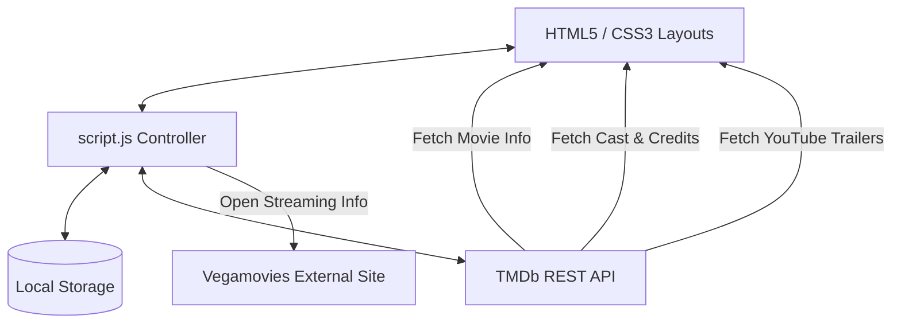

# MidnightFlix | Smart Movie Discovery & Recommendation Platform

MidnightFlix is a premium, client-side movie discovery and recommendation web application. It features a fully responsive cinematic UI with dark/light themes, search/filtering options, trailer embedding, and detailed movie breakdowns.

---

## 🏗️ Architecture Overview

MidnightFlix is built as a **decoupled, client-side single-page application (SPA)** utilizing simple, dependency-free web technologies:
 


### 1. Presentation Layer (HTML5 & CSS3)
- **`index.html`**: Handles the main exploration hub, landing/hero section with simulated login cards, filter grids, movie recommendation containers, and details/trailer modals.
- **`settings.html`**: Provides a dedicated configuration page for profile customization, notifications, security preferences, and language selection.
- **`style.css`**: Built on CSS custom variables (`--bg`, `--primary`, etc.) for seamless runtime dark-to-light theme switching. Uses CSS Grid and Flexbox for responsive scaling on all mobile, tablet, and desktop screens.

### 2. Application Logic & Controller (`script.js`)
- **State Management**: Manages pagination (`currentPage`, `totalPages`), query attributes, and user authentication state.
- **API Wrapper**: Performs asynchronous fetch queries to The Movie Database (TMDb) for live data.
- **DOM Manipulator**: Renders dynamic movie grids, populates filter parameters, and triggers modal visibility.

### 3. API & Data Storage Integration
- **TMDb API (v3)**: Serves as the primary content provider, supplying metadata, poster paths, YouTube trailer keys, genres, and cast details.
- **Client Storage (`localStorage`)**: Persists UI configuration choices (theme selection) and user session/authentication states (including guest modes).

---

## 📂 File Directory Structure

The project has a lightweight directory structure keeping code modular and easy to deploy:

*   [**`index.html`**](file:///d:/Mini%20Project%202nd%20Year/index.html) - Main dashboard and exploration page.
*   [**`settings.html`**](file:///d:/Mini%20Project%202nd%20Year/settings.html) - Preferences page (theme switch, notifications, mock profile info).
*   [**`style.css`**](file:///d:/Mini%20Project%202nd%20Year/style.css) - Styling sheet containing color themes, animation keys, and structural layouts.
*   [**`script.js`**](file:///d:/Mini%20Project%202nd%20Year/script.js) - Application logic, endpoint calls, and dynamic HTML rendering.
*   [**`README.md`**](file:///d:/Mini%20Project%202nd%20Year/README.md) - Project documentation (this file).

---

## ✨ Key Features

1.  **Cinematic Landing Page & Authentications**:
    *   Responsive split-layout Hero section highlighting platform features.
    *   Simulated Client-Side Authentication (Login, Sign-Up, Google Sign-In mockup, Guest mode).
2.  **Smart Movie Exploration**:
    *   Instant search with keyboard listeners (`Enter` key support).
    *   Dynamic category filters powered directly by TMDb genres.
    *   Granular filter options: Release Year, Minimum Rating thresholds, and Languages.
3.  **Interactive Overlays & Modals**:
    *   **Movie Details Overlay**: Displays full summary, genre list, rating, and the primary cast members (up to 5 actors).
    *   **Embedded Trailer Player**: Retrieves YouTube keys dynamically and plays trailers inside an iframe overlay.
4.  **Aesthetics & Customization**:
    *   Custom dual-theme support (Dark mode is active by default; can toggle between light and dark).
    *   Dynamic glassmorphism design accents.
    *   Settings control panels to customize regional preferences.

---

## 🔌 API Details

The project utilizes **TMDb API (v3)** endpoints to provide dynamic content.

### Main Endpoints Used:
- **Genres List**: `GET /genre/movie/list`
- **Discover (Filters)**: `GET /discover/movie`
- **Search Query**: `GET /search/movie`
- **Movie Details**: `GET /movie/{movie_id}`
- **Credits (Cast)**: `GET /movie/{movie_id}/credits`
- **Videos (Trailers)**: `GET /movie/{movie_id}/videos`

---

## 🚀 Getting Started

### Prerequisites
A modern web browser (Google Chrome, Firefox, Safari, Microsoft Edge). No command-line tools are strictly required.

### Setup Instructions

1.  **Clone or Download this Repository**:
    ```bash
    git clone https://github.com/rohanjha9260/Movie-Recommandation-Project.git
    cd Movie-Recommandation-Project
    ```
2.  **Open the Application**:
    *   **Double-click** the [index.html](file:///d:/Mini%20Project%202nd%20Year/index.html) file, or
    *   Run a local development server for a more reliable API behavior (highly recommended to bypass local CORS rules):
        ```bash
        # Using Python 3.x
        python -m http.server 8000
        ```
        Then, open `http://localhost:8000` in your web browser.

---

## 🛠️ Development & Modification

*   **Change API Keys**: If you want to use your own TMDb credentials, update the `apiKey` variable at the top of [`script.js`](file:///d:/Mini%20Project%202nd%20Year/script.js):
    ```javascript
    const apiKey = 'YOUR_TMDB_API_KEY';
    ```
*   **Modify Color Palette**: Open [`style.css`](file:///d:/Mini%20Project%202nd%20Year/style.css) and customize CSS variables inside the `:root` (dark theme) and `body[data-theme="light"]` selectors.
